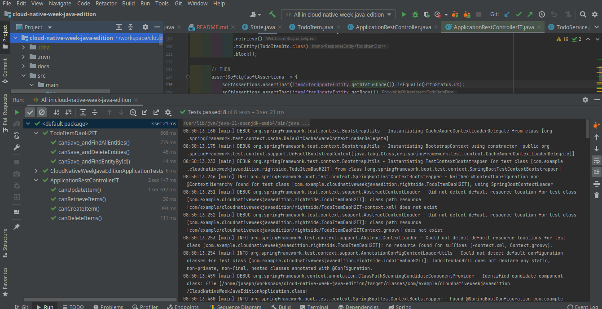

# Cloud Native Week - Java Edition

---

Sommaire
=================

<!--ts-->

- [Introduction](#introduction)
- [1. Writing the application](#exécution-du-code-dinfra)
  * [1.1 Presentation](#11-presentation)
  * [1.2 Executing the project](#12-executing-the-project)

---

# Introduction

The goal of this project is to reproduce a week long workshop where we took a todo app written in Go, and added on top of it:
- observability
  - tracing
  - metrics
  - logs aggregation
- ci/cd pipeline
- alerting
- and some other "cloud native" things

This time, the point is to do it on my own, and with `Java`

# 1. Writing the application

## 1.1 Presentation

The first task is to write a "Todo" Java application. It allows for the execution of the following actions:
- create item
- find item by id
- find all items
- update item
- delete item by id
- delete all items

It exposes a REST interface and connects to H2 or MySQL. Here is a schema of the architecture:


Just for the sake of it, we went for a full reactive stack.

## 1.2 Executing the project

### 1.2.1 Pre-requisites

In order to execute the project locally you will need:
- java 11 or +
- maven
- docker
- docker-compose

### 1.2.2 Executing tests
1. via the CLI

```shell
mvn clean verify
```


2. Via the IDE (here we use `IntelliJ`)



### 1.2.3 Starting the application

1. Start the database (MySQL) with `docker-compose`

```shell
docker-compose down && docker-compose up
```


2. Start the application. The main class is `CloudNativeWeekJavaEditionApplication`


3. Execute CRUD operations
- Create items
```shell
✗|→ curl localhost:8080/items -w "\n"

✗|→ curl -H "content-type: application/json" -X POST localhost:8080/items -d '{"name": "item1", "state":"TODO"}' -w "\n"
{"id":1,"name":"item1","state":"TODO"}
✗|→ curl -H "content-type: application/json" -X POST localhost:8080/items -d '{"name": "item2", "state":"DOING"}' -w "\n"
{"id":2,"name":"item2","state":"DOING"}
✗|→ curl -H "content-type: application/json" -X POST localhost:8080/items -d '{"name": "item3", "state":"DONE"}' -w "\n"
{"id":3,"name":"item3","state":"DONE"}
✗|→ curl localhost:8080/items -w "\n"
{"id":1,"name":"item1","state":"TODO"}
{"id":2,"name":"item2","state":"DOING"}
{"id":3,"name":"item3","state":"DONE"}

```

- Update item

```shell
✗|→ curl -H "content-type: application/json" -X PUT localhost:8080/items/2 -d '{"id": 2, "name": "item2", "state":"DONE"}' -w "\n"
{"id":2,"name":"item2","state":"DONE"}
✗|→ curl localhost:8080/items -w "\n"
{"id":1,"name":"item1","state":"TODO"}
{"id":2,"name":"item2","state":"DONE"}
{"id":3,"name":"item3","state":"DONE"}

```

- Delete item by id

```shell
✗|→ curl -X DELETE localhost:8080/items/2 -w "\n"

✗|→ curl localhost:8080/items -w "\n"
{"id":1,"name":"item1","state":"TODO"}
{"id":3,"name":"item3","state":"DONE"}

```

- Delete all items

```shell
✗|→ curl -X DELETE localhost:8080/items -w "\n"

✗|→ curl localhost:8080/items -w "\n"

✗|→ 
```